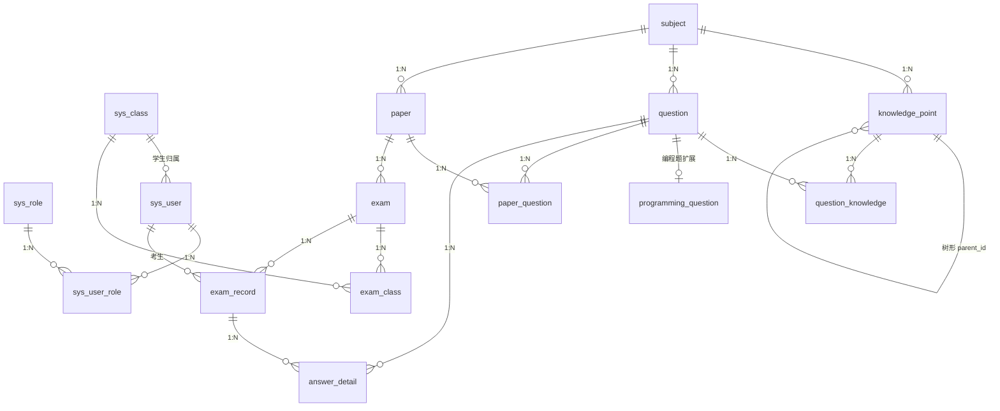

# 数据库设计

> 数据库：`exam_system`　字符集：`utf8mb4`　引擎：InnoDB　MySQL 8.0+
>
> 建库脚本：[`sql/schema.sql`](../sql/schema.sql)

## 一、概述

系统共 **15 张表**，按业务划分为 4 个域：

| 域 | 表 | 数量 |
|----|----|----|
| 用户与权限域 | `sys_role`、`sys_class`、`sys_user`、`sys_user_role` | 4 |
| 题库域 | `subject`、`knowledge_point`、`question`、`question_knowledge`、`programming_question` | 5 |
| 试卷域 | `paper`、`paper_question` | 2 |
| 考试与答题域 | `exam`、`exam_class`、`exam_record`、`answer_detail` | 4 |

## 二、核心设计理念

1. **题目与试卷解耦**：题目（`question`）不直接属于某张试卷，通过 `paper_question` 多对多关联，并在关联表中**快照每题在该试卷中的分值**（`score`）与顺序（`sort`），实现"同一道题在不同试卷里分值不同"。
2. **答题明细作为统计原始数据**：`answer_detail` 记录每一题的用户答案、得分、判分状态，成绩统计（平均/最高/最低/及格率/排名/班级对比）都基于它聚合，而非只存一个总分。
3. **全题型统一建模**：7 种题型（单选/多选/判断/填空/简答/论述/编程）都放在 `question` 表，用 `question_type` 区分；编程题的特殊字段（语言/时间/内存/测试用例）放到 `programming_question` 扩展表。
4. **判分方式可配置**：`judge_mode`（1 自动 / 2 人工）让填空、简答这类半主观题也能选择自动判分或人工阅卷。

## 三、ER 关系图

## 四、表结构说明

### 4.1 用户与权限域

#### `sys_role` 角色表

| 字段 | 类型 | 说明 |
|------|------|------|
| id | BIGINT | 主键 |
| role_name | VARCHAR(50) | 角色名称 |
| role_code | VARCHAR(50) | 角色编码：`ADMIN` / `TEACHER` / `STUDENT`，唯一 |
| description | VARCHAR(200) | 描述 |

初始数据：管理员（ADMIN）、教师（TEACHER）、学生（STUDENT）。

#### `sys_class` 班级表

| 字段 | 类型 | 说明 |
|------|------|------|
| id | BIGINT | 主键 |
| class_name | VARCHAR(50) | 班级名称，唯一 |
| grade | VARCHAR(20) | 年级，如 `2023级` |
| major | VARCHAR(50) | 专业/院系 |

#### `sys_user` 用户表

| 字段 | 类型 | 说明 |
|------|------|------|
| id | BIGINT | 主键 |
| username | VARCHAR(50) | 登录名，唯一 |
| password | VARCHAR(100) | 密码（BCrypt 存储） |
| real_name | VARCHAR(50) | 真实姓名 |
| email / phone | VARCHAR | 邮箱 / 手机号 |
| class_id | BIGINT | 所属班级（仅学生） |
| status | TINYINT | 1 启用 / 0 禁用 |

#### `sys_user_role` 用户-角色关联表

`user_id` + `role_id` 联合唯一，多对多关联。

### 4.2 题库域

#### `subject` 学科表

| 字段 | 类型 | 说明 |
|------|------|------|
| id | BIGINT | 主键 |
| name | VARCHAR(50) | 学科名称，唯一 |
| code | VARCHAR(50) | 学科编码 |

#### `knowledge_point` 知识点表

| 字段 | 类型 | 说明 |
|------|------|------|
| id | BIGINT | 主键 |
| subject_id | BIGINT | 所属学科 |
| name | VARCHAR(100) | 知识点名称 |
| parent_id | BIGINT | 父知识点，`0` 为根，树形结构 |

#### `question` 题目表（题库核心）

| 字段 | 类型 | 说明 |
|------|------|------|
| id | BIGINT | 主键 |
| subject_id | BIGINT | 所属学科 |
| question_type | TINYINT | 题型：1 单选 / 2 多选 / 3 判断 / 4 填空 / 5 简答 / 6 论述 / 7 编程 |
| content | TEXT | 题干 |
| options | JSON | 选项（单选/多选）：`[{"key":"A","text":"..."}]` |
| answer | TEXT | 标准答案：选择存 `"A"` 或 `"A,C"`；判断存 `"T"/"F"`；填空存 JSON 数组 `["北京","上海"]` |
| analysis | TEXT | 答案解析 |
| difficulty | TINYINT | 1 易 / 2 中 / 3 难 |
| default_score | DECIMAL(5,1) | 默认分值 |
| creator_id | BIGINT | 创建人 |
| status | TINYINT | 1 启用 / 0 停用 |
| judge_mode | TINYINT | 判分方式：1 自动 / 2 人工（仅填空/简答生效） |

#### `question_knowledge` 题目-知识点关联表

`question_id` + `knowledge_point_id` 联合唯一，多对多关联。

#### `programming_question` 编程题扩展表

| 字段 | 类型 | 说明 |
|------|------|------|
| question_id | BIGINT | 题目 ID（主键，1:1） |
| languages | VARCHAR(200) | 支持语言，逗号分隔，如 `java,cpp,python` |
| time_limit | INT | 时间限制（毫秒） |
| memory_limit | INT | 内存限制（MB） |
| test_cases | JSON | 测试用例：`[{"input":"1 2","output":"3"}]` |

### 4.3 试卷域

#### `paper` 试卷表

| 字段 | 类型 | 说明 |
|------|------|------|
| id | BIGINT | 主键 |
| name | VARCHAR(100) | 试卷名称 |
| subject_id | BIGINT | 所属学科 |
| total_score | DECIMAL(6,1) | 总分，默认 100 |
| duration | INT | 考试时长（分钟），默认 60 |
| difficulty | TINYINT | 整体难度 |
| creator_id | BIGINT | 创建人 |
| status | TINYINT | 1 草稿 / 2 发布 |

#### `paper_question` 试卷-题目关联表

| 字段 | 类型 | 说明 |
|------|------|------|
| id | BIGINT | 主键 |
| paper_id | BIGINT | 试卷 ID |
| question_id | BIGINT | 题目 ID |
| score | DECIMAL(5,1) | **该题在本试卷中的分值**（快照） |
| sort | INT | 题目顺序（组卷排序） |

`paper_id` + `question_id` 联合唯一。

### 4.4 考试与答题域

#### `exam` 考试安排表

| 字段 | 类型 | 说明 |
|------|------|------|
| id | BIGINT | 主键 |
| name | VARCHAR(100) | 考试名称 |
| paper_id | BIGINT | 试卷 ID |
| start_time / end_time | DATETIME | 开始 / 结束时间 |
| duration | INT | 作答时长（分钟），为空则取试卷时长 |
| status | TINYINT | 1 未开始 / 2 进行中 / 3 已结束 |

#### `exam_class` 考试-班级关联表

`exam_id` + `class_id` 联合唯一，指定参加考试的班级。

#### `exam_record` 作答记录表（一次考试一条，承载最终成绩）

| 字段 | 类型 | 说明 |
|------|------|------|
| id | BIGINT | 主键 |
| exam_id / paper_id / user_id | BIGINT | 考试 / 试卷 / 考生 |
| start_time / submit_time | DATETIME | 开始作答 / 交卷时间 |
| objective_score | DECIMAL(6,1) | 客观题得分 |
| subjective_score | DECIMAL(6,1) | 主观题得分 |
| total_score | DECIMAL(6,1) | 总分 |
| status | TINYINT | 1 进行中 / 2 已交卷 / 3 已判分 |

`exam_id` + `user_id` 联合唯一（同一考试同一人仅一条记录）。

#### `answer_detail` 答题明细表（统计原始数据）

| 字段 | 类型 | 说明 |
|------|------|------|
| id | BIGINT | 主键 |
| exam_record_id | BIGINT | 作答记录 ID |
| question_id | BIGINT | 题目 ID |
| question_type | TINYINT | 冗余题型，便于统计 |
| user_answer | TEXT | 考生答案 |
| is_correct | TINYINT | 是否正确（客观题）：1 对 / 0 错 |
| score | DECIMAL(5,1) | 本题得分 |
| judge_status | TINYINT | 判分状态：0 待判 / 1 判分中 / 2 已判 |
| judge_by | BIGINT | 阅卷人 |
| judge_time | DATETIME | 阅卷时间 |
| comment | VARCHAR(500) | 阅卷评语 |

## 五、索引设计要点

- 高频查询字段均建索引：`question(subject_id, question_type)`、`exam(start_time, end_time)`、`answer_detail(judge_status)` 等。
- 所有多对多关联表均用 `UNIQUE KEY` 防重复关联。
- `exam_record` 的 `exam_id + user_id`、`answer_detail` 的 `exam_record_id + question_id` 联合唯一，保证幂等。

## 六、初始数据

- **角色**：`sql/schema.sql` 中直接插入 `ADMIN` / `TEACHER` / `STUDENT` 三个角色。
- **默认管理员**：`admin / 123456`，由后端 `DataInitializer` 在应用启动时**自动创建**，密码用 BCrypt 运行时加密，不在 SQL 里硬编码哈希（避免明文/固定哈希泄露）。
